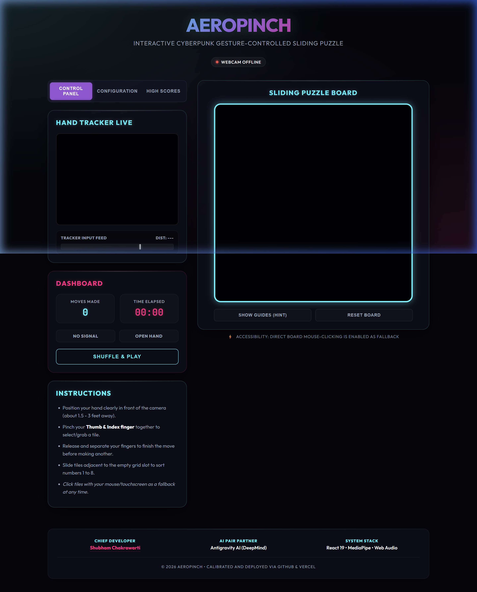

# ⚡ AeroPinch | Cyberpunk Gesture-Controlled Jigsaw Puzzle

AeroPinch is an interactive jigsaw puzzle controlled entirely by webcam hand gestures. Built with React and MediaPipe, it features dynamic difficulties, 8-bit sound effects synthesized on-the-fly, canvas-based particle physics, and a hardware gesture monitor.

<p align="center">
  <a href="https://webcam-puzzle-flax.vercel.app" target="_blank">
    
  </a>
  <a href="https://portfolio-nine-alpha-m0jhu0c4o1.vercel.app" target="_blank">
    
  </a>
  <a href="https://github.com/khushi2008hc-lab/webcam-puzzle" target="_blank">
    
  </a>
  <a href="LICENSE">
    
  </a>
</p>

---

## 🚀 Live Deployed Links

| Platform | Live Link | Status |
| :--- | :--- | :--- |
| **▲ Vercel Production** | [webcam-puzzle-flax.vercel.app](https://webcam-puzzle-flax.vercel.app) | 🟢 Live & Active |
| **🌐 Developer Portfolio** | [portfolio-nine-alpha-m0jhu0c4o1.vercel.app](https://portfolio-nine-alpha-m0jhu0c4o1.vercel.app) | 🟢 Live & Active |

---

## 📸 Interface Preview



---

## ✨ Key Features

* **Select-and-Swap Jigsaw Mode**: Fluid drag-and-drop gameplay. Click-hold or pinch a tile to pick it up, drag it floating over the grid (with 3D shadows and scale-lift animations), and drop to swap values.
* **Aspect Ratio Center-Cropping**: Automatically crops webcam streams and presets to a perfect square, correcting proportions and removing vertical stretching.
* **Procedural Sound Synth (Web Audio API)**: Produces 8-bit sound effects (Pinch Grab, Pinch Release, Slide Swap, and a C-major Victory melody) natively inside the browser context without static files.
* **Multi-Difficulty Grid Scaling (3x3, 4x4, 5x5)**: Display size is upscaled to 600px which aligns perfectly with all grid sizes without pixel truncation.
* **Hardware Calibration HUD**: Real-time graph monitoring index-thumb distance against the gesture threshold. Directly updates DOM nodes in the frame loop, bypassing React render overhead for zero input latency.
* **VFX Particle Sprites**: Canvas particles blast on tile swaps and victory solve events, with trailing glow cursors following hand movements.

---

## 🛠️ Tech Stack

* **Framework**: React 19 (Hooks, Refs, state context synchronizers)
* **Build System**: Vite
* **Gesture Tracking**: MediaPipe Hands & Camera Utils
* **Audio Synthesis**: Native Web Audio API
* **Graphics Layout**: Custom Vanilla CSS (Dark Cyberpunk Glassmorphic theme)
* **CI/CD Host**: Vercel & GitHub Actions

---

## 💻 Local Setup & Development

To run this project locally:

1. **Clone the repository**:
   ```bash
   git clone https://github.com/khushi2008hc-lab/webcam-puzzle.git
   cd webcam-puzzle
   ```
2. **Install node dependencies**:
   ```bash
   npm install
   ```
3. **Boot the Vite hot-reloading dev server**:
   ```bash
   npm run dev
   ```
4. **Navigate to localhost**:
   Open [http://localhost:5173](http://localhost:5173) in your browser. (Make sure you allow webcam permissions for gesture tracking!).

---

## 👥 Credits & Developer

* **Lead Architect & Developer**: [Khushi](https://github.com/khushi2008hc-lab)
* **Portfolio**: [Khushi.dev](https://portfolio-nine-alpha-m0jhu0c4o1.vercel.app)
* **Email**: `khushi2008.hc@gmail.com`
* **Hosting Platform**: Deployed and aliased via [Vercel](https://vercel.com)
